# MyBatis的SQL执行流程分析
## 前言

MyBatis可能很多人都一直在用，但是MyBatis的SQL执行流程可能并不是所有人都清楚了，那么既然进来了，通读本文你将收获如下：

1、Mapper接口和映射文件是如何进行绑定的
2、MyBatis中SQL语句的执行流程
3、自定义MyBatis中的参数设置处理器typeHandler
4、自定义MyBatis中结果集处理器typeHandler

PS：本文基于MyBatis3.5.5版本源码

## 概要

在MyBatis中，利用编程式进行数据查询，主要就是下面几行代码：

```java
SqlSession session = sqlSessionFactory.openSession();
UserMapper userMapper = session.getMapper(UserMapper.class);
List<LwUser> userList = userMapper.listUserByUserName("孤狼1号");
```


第一行是获取一个SqlSession对象，第二行就是获取UserMapper接口，第三行一行代码就实现了整个查询语句的流程，接下来我们就来仔细分析一下第二和第三步。

## 获取Mapper接口(getMapper)

第二步是通过SqlSession对象是获取一个Mapper接口，这个流程还是相对简单的，下面就是我们调用session.getMapper方法之后的运行时序图：

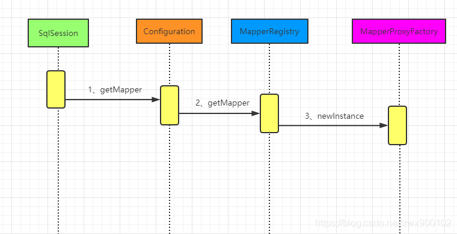

1、在调用getMapper之后，会去Configuration对象中获取Mapper对象，因为在项目启动的时候就会把Mapper接口加载并解析存储到Configuration对象

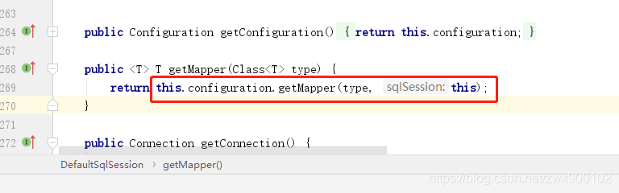

2、通过Configuration对象中的MapperRegistry对象属性，继续调用getMapper方法

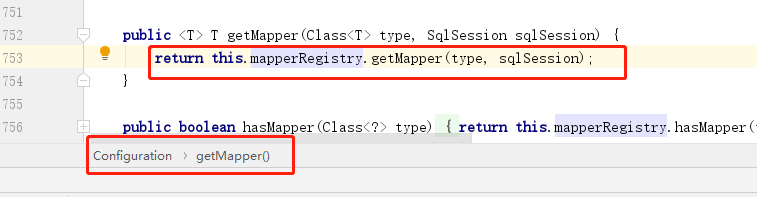

3、根据type类型，从MapperRegistry对象中的knownMappers获取到当前类型对应的代理工厂类，然后通过代理工厂类生成对应Mapper的代理类

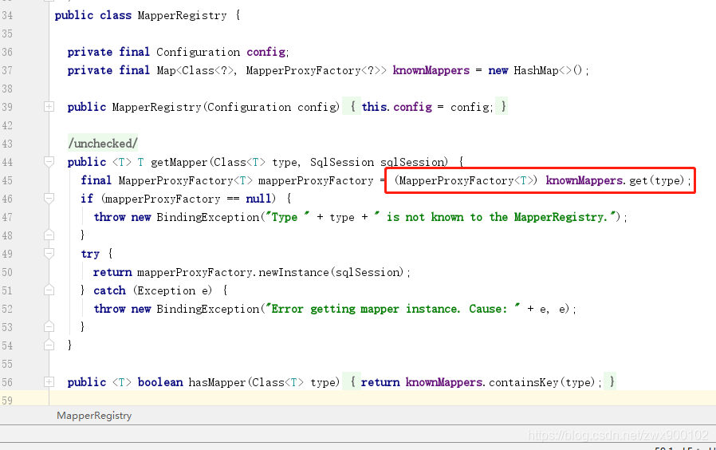

4、最终获取到我们接口对应的代理类MapperProxy对象

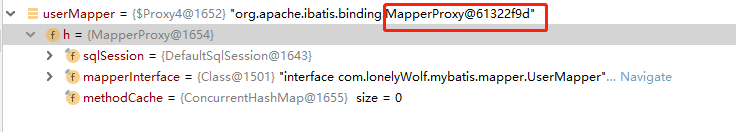

而MapperProxy可以看到实现了InvocationHandler，使用的就是JDK动态代理。

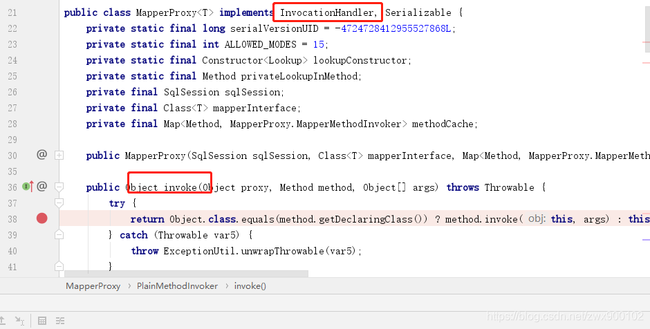

至此获取Mapper流程结束了，那么就有一个问题了MapperRegistry对象内的HashMap属性knownMappers中的数据是什么时候存进去的呢？

## Mapper接口和映射文件是何时关联的

Mapper接口及其映射文件是在加载mybatis-config配置文件的时候存储进去的，下面就是时序图：

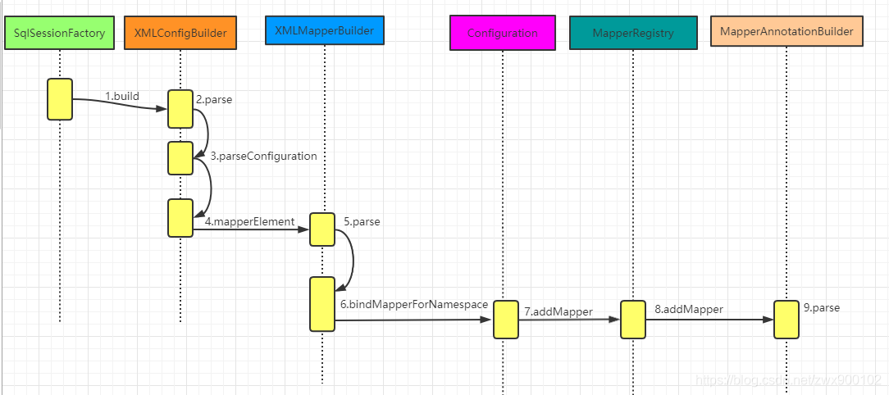

1、首先我们会手动调用SqlSessionFactoryBuilder方法中的build()方法：

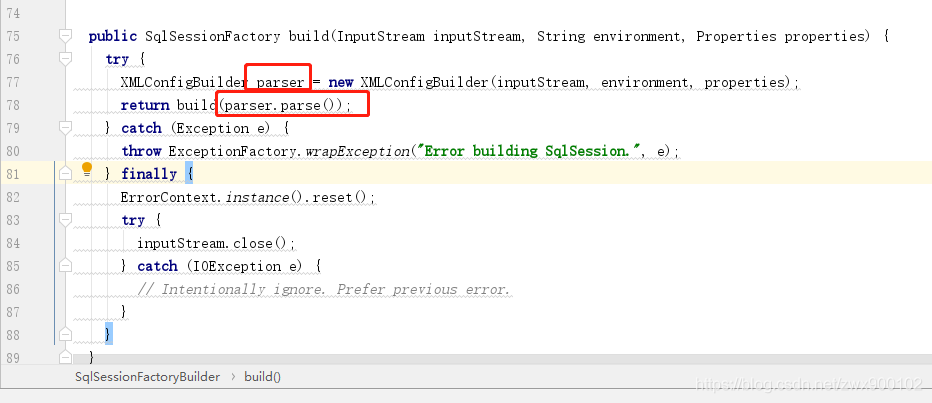

2、然后会构造一个XMLConfigBuilder对象，并调用其parse方法：

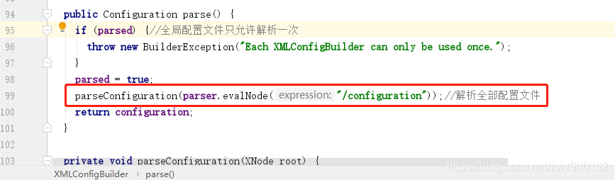

3、然后会继续调用自己的parseConfiguration来解析配置文件，这里面就会分别去解析全局配置文件的顶级节点，其他的我们先不看，我们直接看最后解析mappers节点

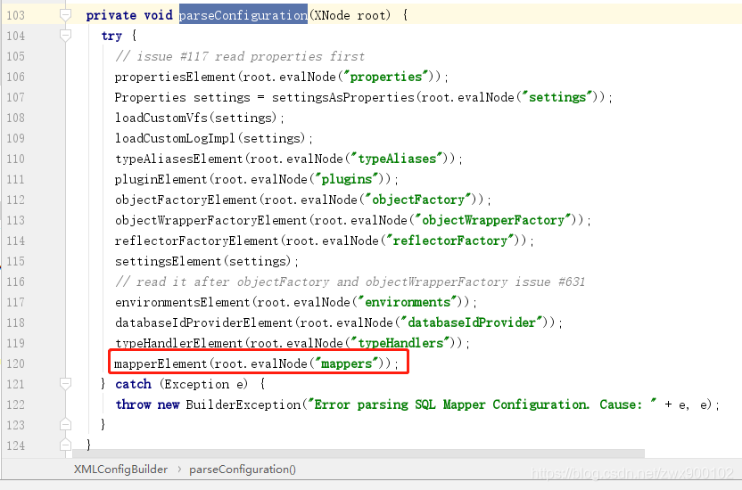

4、继续调用自己的mapperElement来解析mappers文件（这个方法比较长，为了方便截图完整，所以把字体缩小了1号），可以看到，这里面分了四种方式来解析mappers节点的配置，对应了4种mapper配置方式，而其中红框内的两种方式是直接配置的xml映射文件，蓝框内的两种方式是解析直接配置Mapper接口的方式，从这里也可以说明，不论配置哪种方式，最终MyBatis都会将xml映射文件和Mapper接口进行关联。

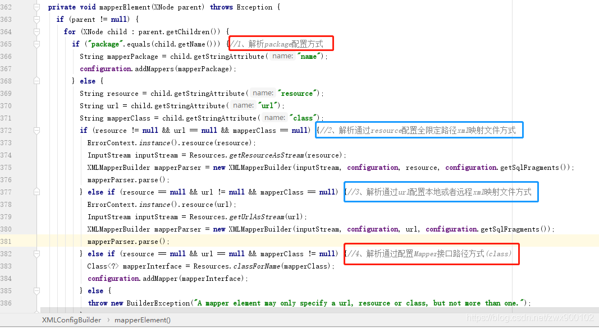

5、我们先看第2种和第3中（直接配置xml映射文件的解析方式），会构建一个XMLMapperBuilder对象并调用其parse方法。

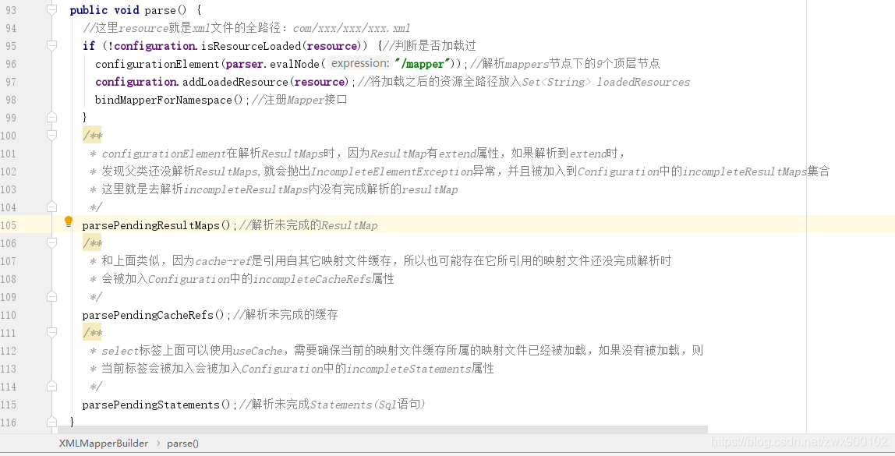

但是这里有一个问题，如果有多重继承或者多重依赖时在这里是可能会无法被完全解析的，比如说三个映射文件互相依赖，那么if里面(假设是最坏情况)只能加载1个，失败2个，然后走到下面if之外的代码又只能加载1个，还有1个会失败(如下代码中，只会处理1次，再次失败并不会继续加入incompleteResultMaps)：

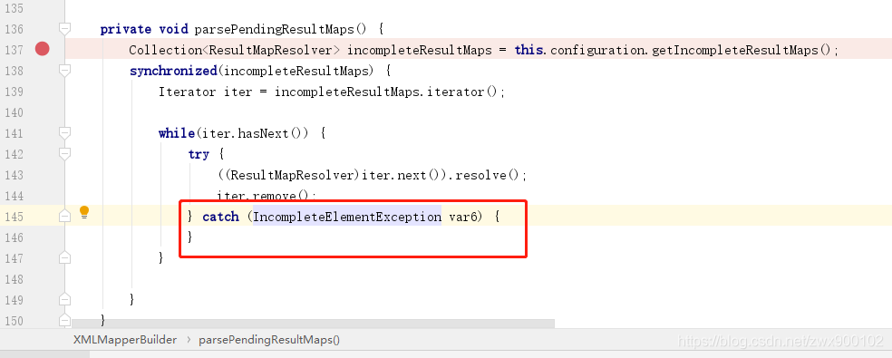

当然，这个还是会被解析的，后面执行查询的时候会再次通过不断遍历去全部解析完毕，不过有一点需要注意的是，互相引用这种是会导致解析失败报错的，所以在开发过程中我们应该避免循环依赖的产生。
6、解析完映射文件之后，调用自身方法bindMapperForNamespace，开始绑定Mapper接口和映射文件：

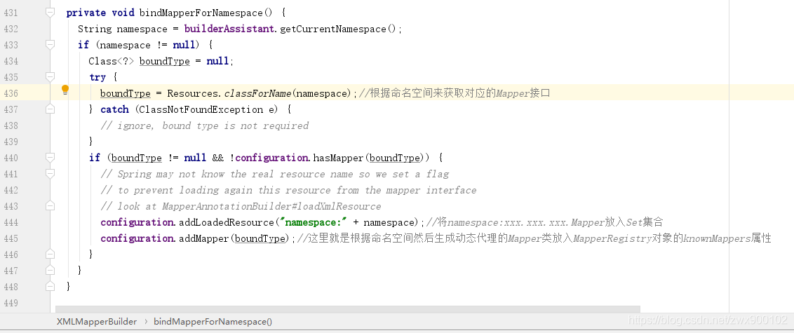

7、调用Configuration对象的addMapper

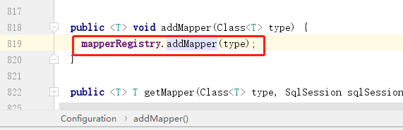

8、调用Configuration对象的属性MapperRegistry内的addMapper方法，这个方法就是正式将Mapper接口添加到knownMappers，所以上面getMapper可以直接获取：

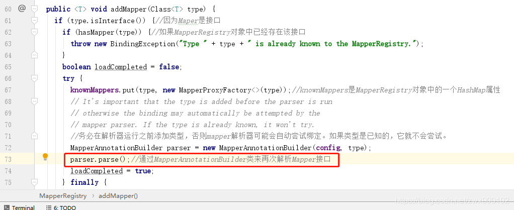

到这里我们就完成了Mapper接口和xml映射文件的绑定
9、注意上面红框里面的代码，又调用了一次parse方法，这个parse方法主要是解析注解，比如下面的语句：

```java
@Select("select * from lw_user")
    List<LwUser> listAllUser();
```


所以这个方法里面会去解析@Select等注解，需要注意的是，parse方法里面会同时再解析一次xml映射文件，因为上面我们提到了mappers节点有4种配置方式，其中两种配置的是Mapper接口，而配置Mapper接口会直接先调用addMapper接口，并没有解析映射文件，所以进入注解解析方法parse之中会需要再尝试解析一次XML映射文件。

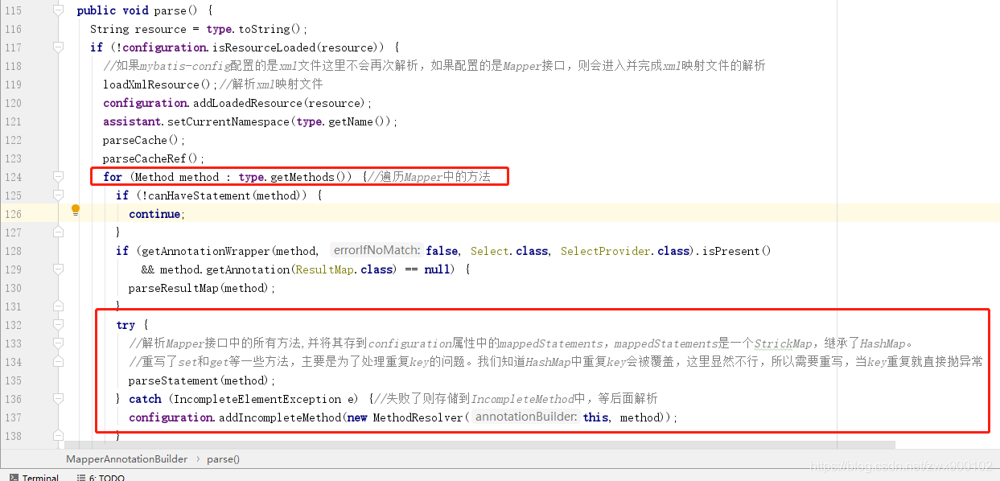

解析完成之后，还会对Mapper接口中的方法进行解析，并将**每个方法的全限定类名作为key**存入存入Configuration中的mappedStatements属性。

需要指出的是，这里存储的时候，同一个value会存储2次，**一个全限定名作为key，另一个就是只用方法名(sql语句的id)来作为key：**

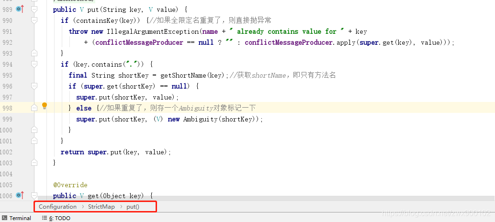

所以最终mappedStatements会是下面的情况：

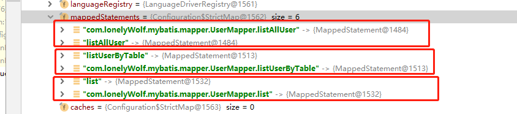

事实上如果我们通过接口的方式来编程的话，最后来getStatement的时候，都是根据全限定名来取的，所以即使有重名对我们也没有影响，而之所以要这么做的原因其实还是为了兼容早期版本的用法，那就是不通过接口，而是直接通过方法名的方式来进行查询：

```java
session.selectList("com.lonelyWolf.mybatis.mapper.UserMapper.listAllUser");
```


这里如果shortName没有重复的话，是可以直接通过简写来查询的：

```java
session.selectList("listAllUser");
```


但是通过简写来查询一旦shortName重复了就会抛出以下异常：

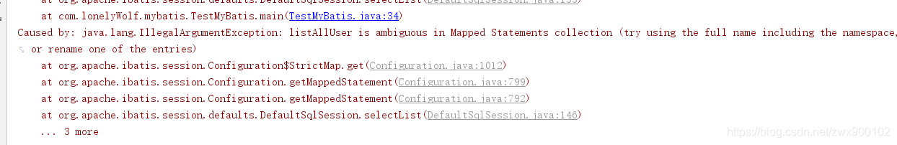

这里的异常其实就是StrickMap的get方法抛出来的：

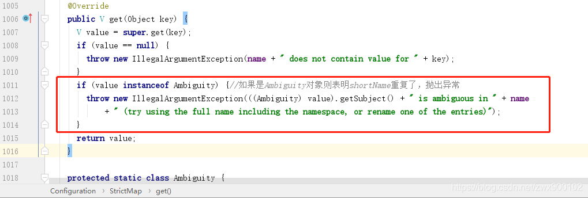

## sql执行流程分析

上面我们讲到了，获取到的Mapper接口实际上被包装成为了代理对象，所以我们执行查询语句肯定是执行的代理对象方法，接下来我们就以Mapper接口的代理对象MapperProxy来分析一下查询流程。

整个sql执行流程可以分为两大步骤：

一、寻找sql
二、执行sql语句

### 寻找sql

首先还是来看一下寻找sql语句的时序图：

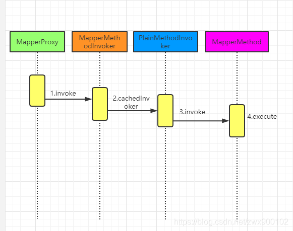

1、了解代理模式的应该都知道，调用被代理对象的方法之后实际上执行的就是代理对象的invoke方法

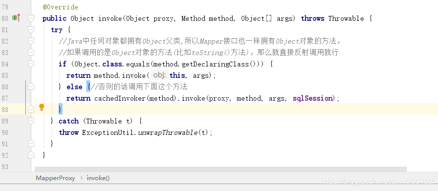

2、因为我们这里并没有调用Object类中的方法，所以肯定走的else。else中会继续调用MapperProxy内部类MapperMethodInvoker中的方法cachedInvoker，这里面会有一个判断，判断一下我们是不是default方法，因为Jdk1.8中接口中可以新增default方法，而default方法是并不是一个抽象方法，所以也需要特殊处理（刚开始会从缓存里面取，缓存相关知识我们这里先不讲，后面会单独写一篇来分析一下缓存)）。

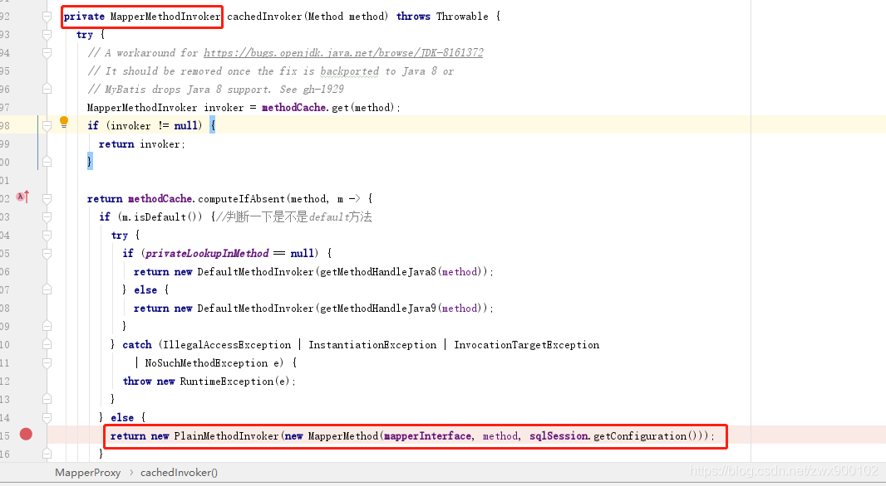

3、接下来，是构造一个MapperMethod对象,这个对象封装了Mapper接口中对应的方法信息以及对应的sql语句信息：

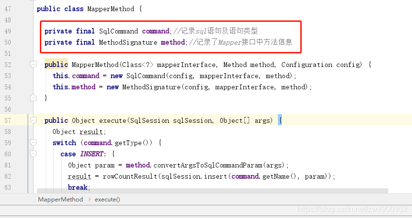

这里面就会把要执行的sql语句，请求参数，方法返回值全部解析封装成MapperMethod对象，然后后面就可以开始准备执行sql语句了

## 执行sql语句

还是先来看一下执行Sql语句的时序图：

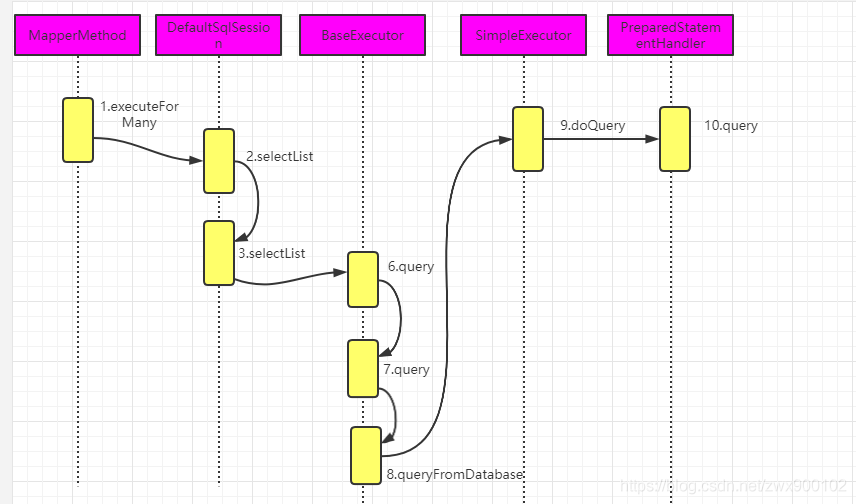

1、我们继续上面的流程进入execute方法：

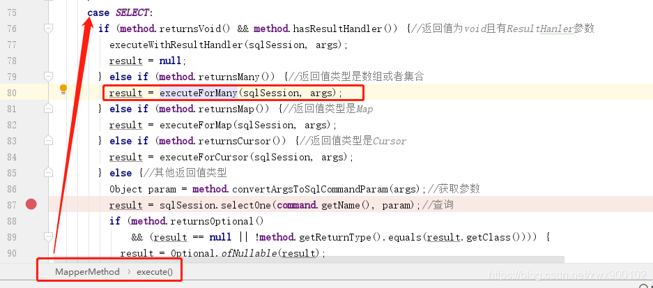

2、这里面会根据语句类型以及返回值类型来决定如何执行，本人这里返回的是一个集合，故而我们进入executeForMany方法：

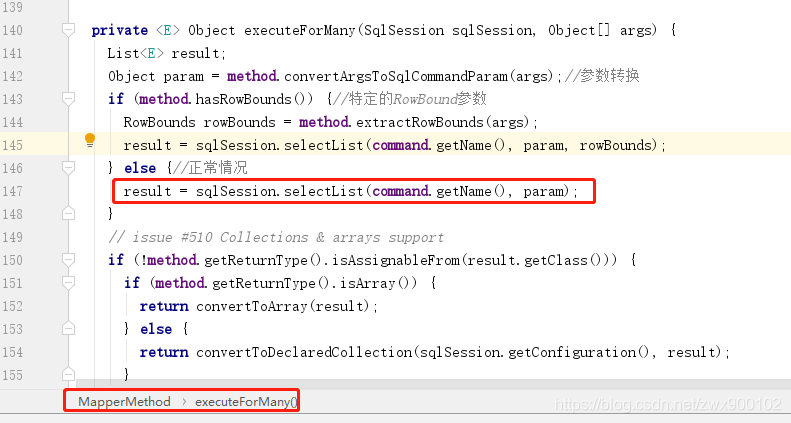

3、这里面首先会将前面存好的参数进行一次转换，然后绕了这么一圈，回到了起点SqlSession对象，继续调用selectList方法：

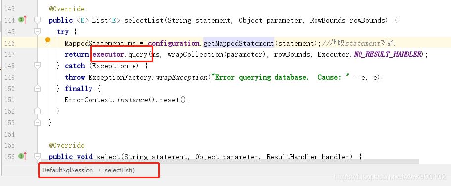

3、接下来又讲流程委派给了Execute去执行query方法，最终又会去调用queryFromDatabase方法：

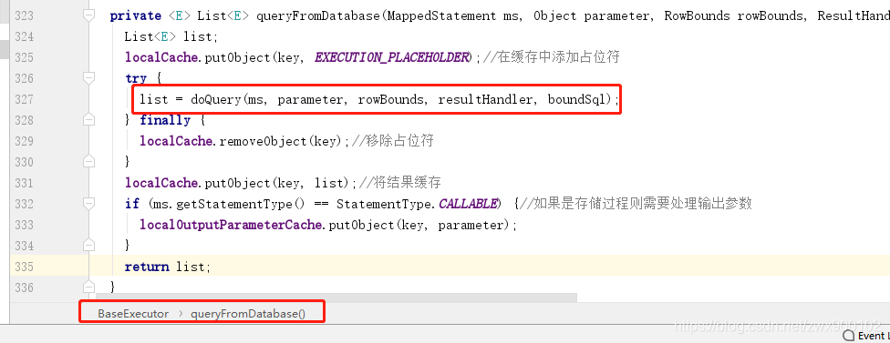

4、到这里之后，终于要进入正题了，一般带了这种do开头的方法就是真正做事的，Spring中很多地方也是采用的这种命名方式：

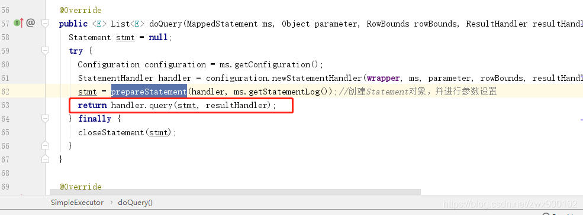

注意，前面我们的sql语句还是占位符的方式，并没有将参数设置进去，所以这里在return上面一行调用prepareStatement方法创建Statement对象的时候会去设置参数，替换占位符。参数如何设置我们先跳过，等把流程执行完了我们在单独分析参数映射和结果集映射。

5、继续进入PreparedStatementHandler对象的query方法，可以看到，这一步就是调用了jdbc操作对象PreparedStatement中的execute方法，最后一步就是转换结果集然后返回。

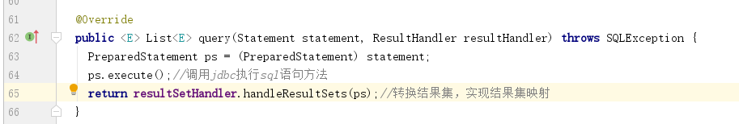

到这里，整个SQL语句执行流程分析就结束了，中途有一些参数的存储以及转换并没有深入进去，因为参数的转换并不是核心，只要清楚整个数据的流转流程，我们自己也可以有自己的实现方式，只要存起来最后我们能重新解析读出来就行。

## 参数映射

现在我们来看一下上面在执行查询之前参数是如何进行设置的，我们先进入prepareStatement方法：

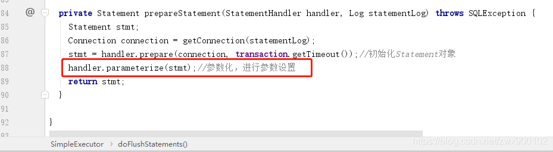

我们发现，最终是调用了StatementHandler中的parameterize进行参数设置，接下来这里为了节省篇幅，我们不会一步步点进去，直接进入设置参数的方法：

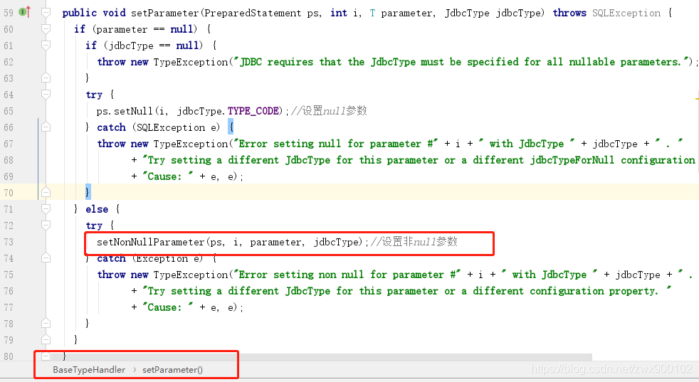

上面的BaseTypeHandler是一个抽象类，setNonNullParameter并没有实现，都是交给子类去实现，而每一个子类就是对应了数据库的一种类型。下图中就是默认的一个子类StringTypeHandler，里面没什么其他逻辑，就是设置参数。

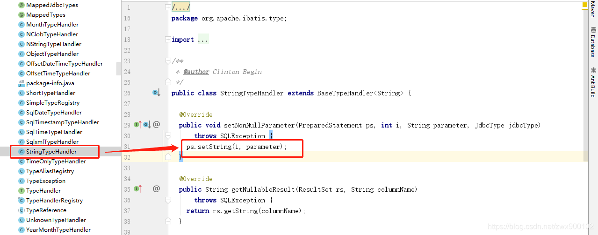

可以看到String里面调用了jdbc中的setString方法，而如果是int也会调用setInt方法。
看到这些子类如果大家之前阅读过我前面讲的MyBatis参数配置，应该就很明显可以知道，这些子类就是系统默认提供的一些typeHandler。而这些默认的typeHandler会默认被注册并和Java对象进行绑定：

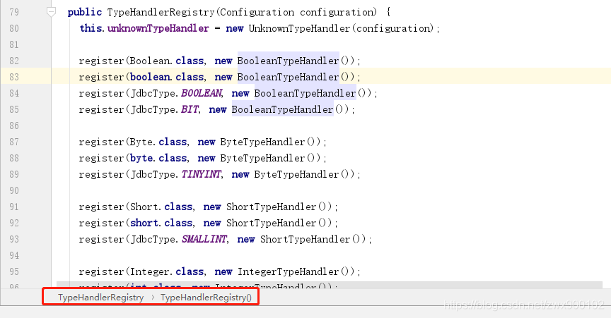

正是因为MyBatis中默认提供了常用数据类型的映射，所以我们写Sql的时候才可以省略参数映射关系，可以直接采用下面的方式，系统可以根据我们参数的类型，自动选择合适的typeHander进行映射：

```java
select user_id,user_name from lw_user where user_name=#{userName}
```


上面这条语句实际上和下面这条是等价的：

```java
select user_id,user_name from lw_user where user_name=#{userName,jdbcType=VARCHAR}
```

或者说我们可以直接指定typeHandler：

```java
select user_id,user_name from lw_user where user_name=#{userName,jdbcType=VARCHAR,typeHandler=org.apache.ibatis.type.IntegerTypeHandler}
```

这里因为我们配置了typeHandler，所以会优先以配置的typeHandler为主不会再去读取默认的映射，如果类型不匹配就会直接报错了：

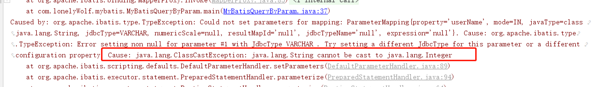

看到这里很多人应该就知道了，如果我们自己自定义一个typeHandler，然后就可以配置成我们自己的自定义类。
所以接下来就让我们看看如何自定义一个typeHandler

## 自定义typeHandler

自定义typeHandler需要实现BaseTypeHandler接口，BaseTypeHandler有4个方法，包括结果集映射，为了节省篇幅，代码没有写上来：

```java
package com.lonelyWolf.mybatis.typeHandler;

import org.apache.ibatis.type.BaseTypeHandler;
import org.apache.ibatis.type.JdbcType;

import java.sql.CallableStatement;
import java.sql.PreparedStatement;
import java.sql.ResultSet;
import java.sql.SQLException;

public class MyTypeHandler extends BaseTypeHandler<String> {

@Override
public void setNonNullParameter(PreparedStatement preparedStatement, int index, String param, JdbcType jdbcType) throws SQLException {
    System.out.println("自定义typeHandler生效了");
    preparedStatement.setString(index,param);
}


```


然后我们改写一下上面的查询语句：

```java
select user_id,user_name from lw_user where user_name=#{userName,jdbcType=VARCHAR,typeHandler=com.lonelyWolf.mybatis.typeHandler.MyTypeHandler}
```


然后执行，可以看到，自定义的typeHandler生效了：

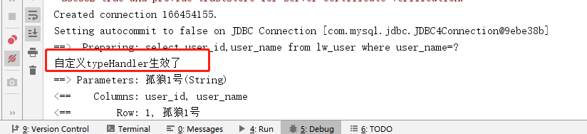

## 结果集映射

接下来让我们看看结果集的映射，回到上面执行sql流程的最后一个方法：

```java
resultSetHandler.handleResultSets(ps)
```


结果集映射里面的逻辑相对来说还是挺复杂的，因为要考虑到非常多的情况，这里我们就不会去深究每一个细节，直接进入到正式解析结果集的代码，下面的5个代码片段就是一个简单的但是完整的解析流程：

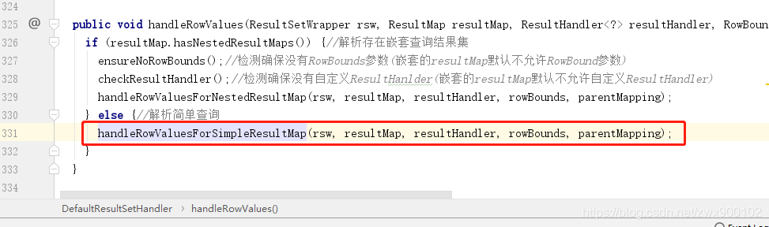

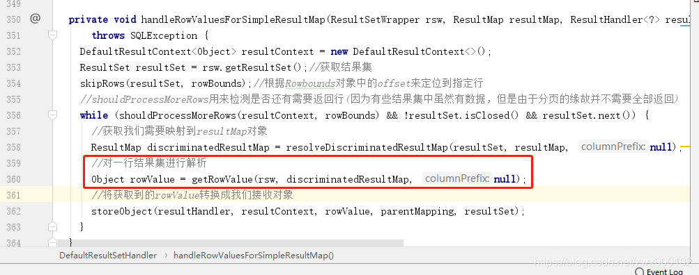

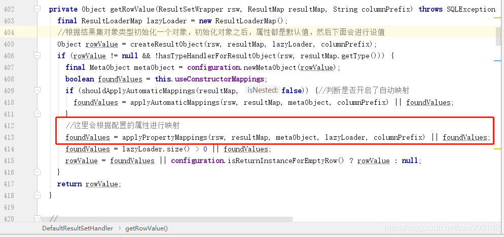

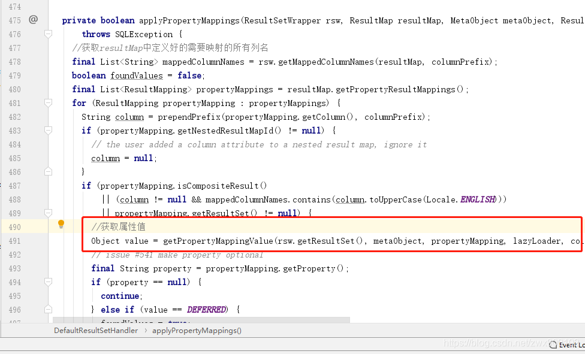

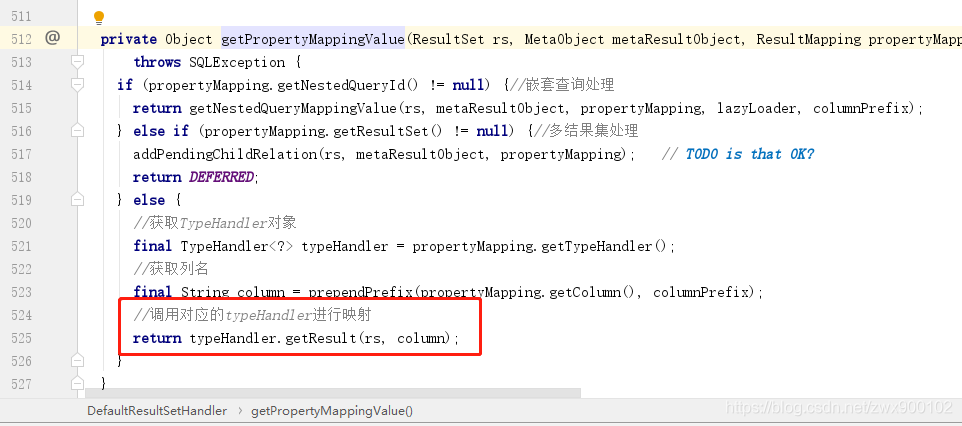

从上面的代码片段我们也可以看到，实际上解析结果集还是很复杂的，就如我们上一篇介绍的复杂查询一样，一个查询可以不断嵌套其他查询，还有延迟加载等等一些复杂的特性
的处理，所以逻辑分支是有很多，但是不管怎么处理，最后的核心还是上面的一套流程，最终还是会调用typeHandler来获取查询到的结果。

是的，你没猜错，这个就是上面我们映射参数的typeHandler，因为typeHandler里面不只是一个设置参数方法，还有获取结果集方法(上面设置参数的时候省略了)。

## 自定义typeHandler结果集

所以说我们还是用上面那个MyTypeHandler 例子来重写一下取值方法(省略了设置参数方法)：


```java
package com.lonelyWolf.mybatis.typeHandler;

import org.apache.ibatis.type.BaseTypeHandler;
import org.apache.ibatis.type.JdbcType;

import java.sql.CallableStatement;
import java.sql.PreparedStatement;
import java.sql.ResultSet;
import java.sql.SQLException;

public class MyTypeHandler extends BaseTypeHandler<String> {

    /**
     * 设置参数
     */
    @Override
    public void setNonNullParameter(PreparedStatement preparedStatement, int index, String param, JdbcType jdbcType) throws SQLException {
        System.out.println("设置参数->自定义typeHandler生效了");
        preparedStatement.setString(index,param);
    }
    /**
     * 根据列名获取结果
     */
    @Override
    public String getNullableResult(ResultSet resultSet, String columnName) throws SQLException {
        System.out.println("根据columnName获取结果->自定义typeHandler生效了");
        return resultSet.getString(columnName);
    }

    /**
     * 根据列的下标来获取结果
     */
    @Override
    public String getNullableResult(ResultSet resultSet, int columnIndex) throws SQLException {
        System.out.println("根据columnIndex获取结果->自定义typeHandler生效了");
        return resultSet.getString(columnIndex);
    }

    /**
     * 处理存储过程的结果集
     */
    @Override
    public String getNullableResult(CallableStatement callableStatement, int columnIndex) throws SQLException {
        return callableStatement.getString(columnIndex);
    }
}

```

改写Mapper映射文件配置：

 

```xml
<resultMap id="MyUserResultMap" type="lwUser">
        <result column="user_id" property="userId" jdbcType="VARCHAR" typeHandler="com.lonelyWolf.mybatis.typeHandler.MyTypeHandler" />
        <result column="user_name" property="userName" jdbcType="VARCHAR" />
    </resultMap>
```

执行之后输出如下：

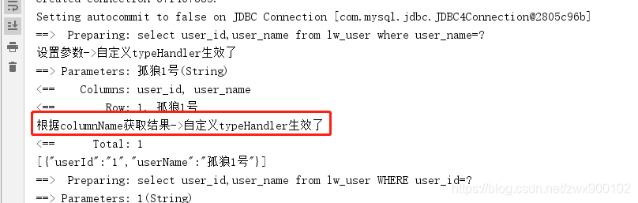

因为我们属性上面只配置了一个属性，所以只输出了一次。

## 工作流程图

上面介绍了代码的流转，可能绕来绕去有点晕，所以我们来画一个主要的对象之间流程图来更加清晰的展示一下MyBatis主要工作流程：

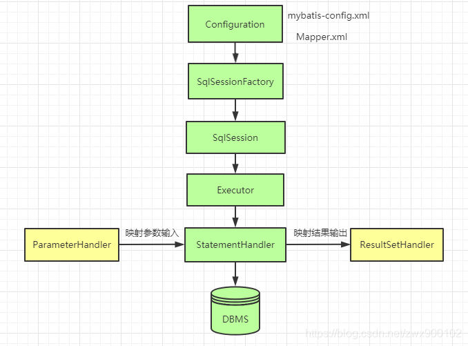

从上面的工作流程图上我们可以看到，SqlSession下面还有4大对象，这4大对象也很重要，后面学习拦截器的时候就是针对这4大对象进行的拦截，关于这4大对象的具体详情，我们下一篇文章再展开分析。

总结
本文主要分析了MyBatis的SQL执行流程。在分析流程的过程中，我们也举例论证了如何自定义typeHandler来实现自定义的参数映射和结果集映射，不过MyBatis中提供的默认映射其实可以满足大部分的需求，如果我们对某些属性需要特殊处理，那么就可以采用自定义的typeHandle来实现，相信如果本文如果读懂了，以下几点大家应该至少会有一个清晰的认识：

- Mapper接口和映射文件是如何进行绑定的
- MyBatis中SQL语句的执行流程
- 自定义MyBatis中的参数设置处理器typeHandler
- 自定义MyBatis中结果集处理器typeHandler

:::tip 来源
版权声明：本文为CSDN博主「双子孤狼」的原创文章，遵循CC 4.0 BY-SA版权协议，转载请附上原文出处链接及本声明。
原文链接：https://blog.csdn.net/zwx900102/article/details/108455514
:::
