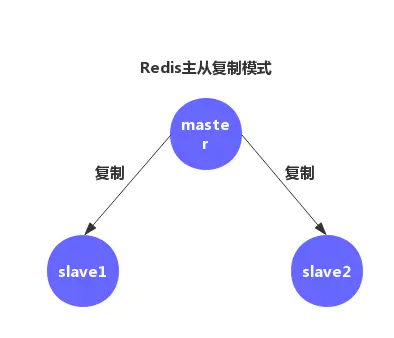
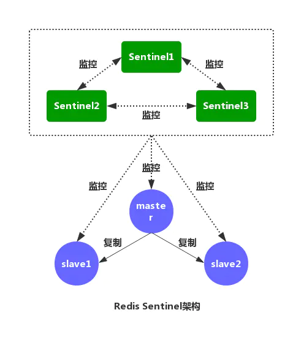
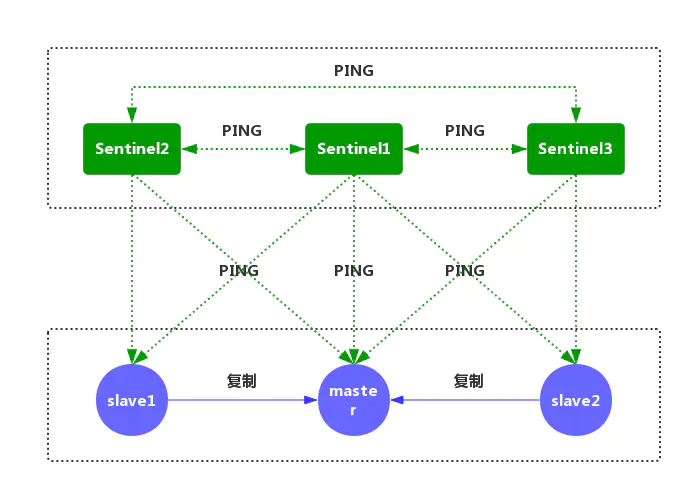
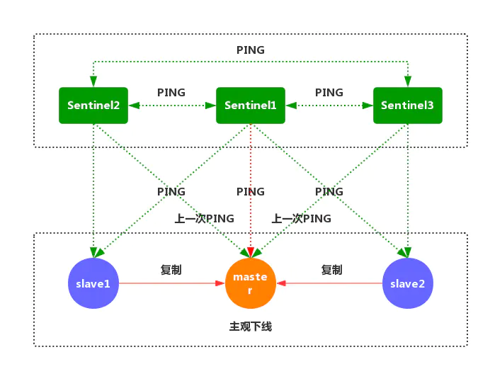
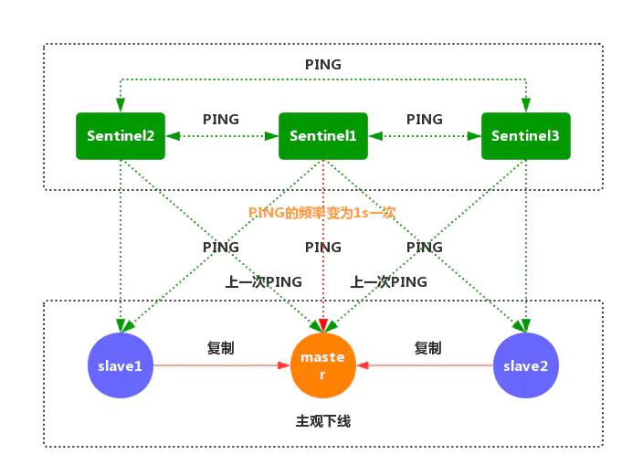
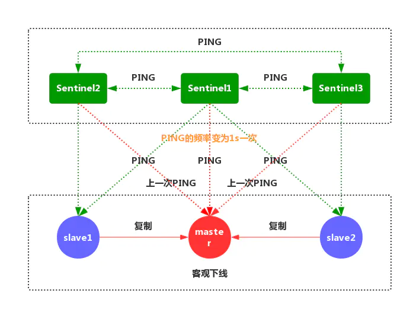
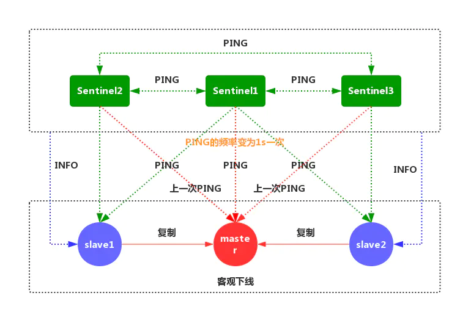
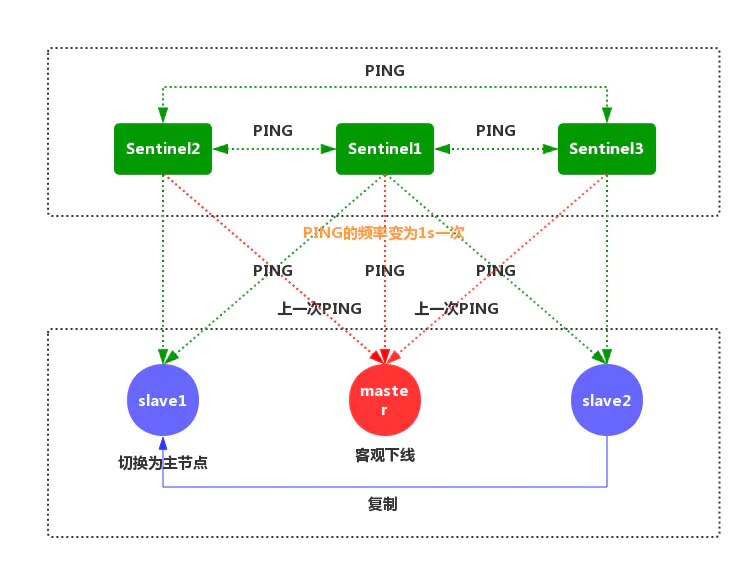
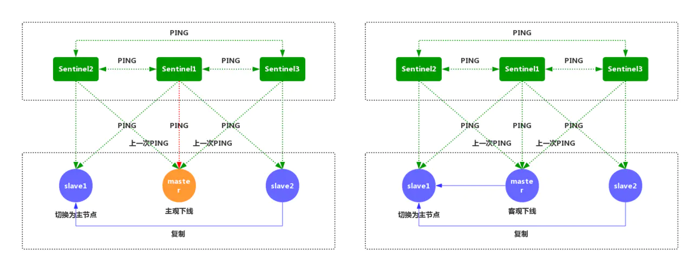

## Redis 官方的高可用解决方案
:::tip 来源
作者：须臾之余   
https://my.oschina.net/u/3995125/blog/3133204
:::


#### Redis主从复制的问题

[Redis](http://mp.weixin.qq.com/s?__biz=MzI0MDQ4MTM5NQ==&mid=2247513229&idx=2&sn=20ed0053a17942bd273a1cc0729a7b59&chksm=e918d191de6f588792a01fbe3d98cc9812e8cbe3f862ce334bbf91e057199859c8e63bd414d4&scene=21#wechat_redirect) 主从复制可将主节点数据同步给从节点，从节点此时有两个作用：

- 一旦主节点宕机，从节点作为主节点的备份可以随时顶上来。
- 扩展主节点的读能力，分担主节点读压力。



**主从复制同时存在以下几个问题**：

- 一旦主节点宕机，从节点晋升成主节点，同时需要修改应用方的主节点地址，还需要命令所有 从节点去复制新的主节点，整个过程需要人工干预。
- 主节点的写能力受到单机的限制。
- 主节点的存储能力受到单机的限制。
- 原生复制的弊端在早期的版本中也会比较突出，比如：[Redis ](http://mp.weixin.qq.com/s?__biz=MzI0MDQ4MTM5NQ==&mid=2247508806&idx=2&sn=82eef6b17ab3f10f1da48be91807534b&chksm=e918c65ade6f4f4c75a1a4a14d8f2b10e901b8e641c1b543e24c902b8a874beca8fb832149e5&scene=21#wechat_redirect)复制中断后，从节点会发起 psync。此时如果同步不成功，则会进行全量同步，主库执行全量备份的同时，可能会造成毫秒或秒级的卡顿。
- 在民工哥技术之路公众号后台回复关键字 Redis手册 免费获取一份redis最佳实践与实战指南电子书

#### Redis 的 哨兵（Sentinel）深入探究

##### [Redis](http://mp.weixin.qq.com/s?__biz=MzI0MDQ4MTM5NQ==&mid=2247506691&idx=2&sn=45645ef63701a94ec5d71273322a75b9&chksm=e918be1fde6f3709eaa33d9706c1e803b7816e3158f5c642fe949230094e4142d4dbc6528d0a&scene=21#wechat_redirect) Sentinel的架构



[Redis](http://mp.weixin.qq.com/s?__biz=MzI0MDQ4MTM5NQ==&mid=2247505422&idx=2&sn=ce618a2cd611564dddfacadc948ab75c&chksm=e918b312de6f3a0452f8e5e188464103b471cf4a2d8083889a71acd3059430da99253c266b26&scene=21#wechat_redirect)的哨兵机制就是解决我们以上主从复制存在缺陷（选举问题），保证我们的Redis高可用，实现自动化故障发现与故障转移。

该系统执行以下三个任务：

- **监控**：哨兵会不断检查你的主服务器和从服务器是否运作正常。
- **提醒**：当被监控的某个[Redis服务器](http://mp.weixin.qq.com/s?__biz=MzI0MDQ4MTM5NQ==&mid=2247505737&idx=2&sn=40cd237449349cc7d59b166263b262a1&chksm=e918b255de6f3b43e2c57d62aaae334ab8deb79af983510e25222f0bd42c3ae62cd96a2d3082&scene=21#wechat_redirect)出现问题时，哨兵可以通过API给程序员发送通知
- **自动故障转移**：主服务器宕机，哨兵会开始一次自动故障转移操作，升级一个从服务器为主服务器，并让其他从服务器改为复制新的主服务器.

#### 配置 Sentinel

[Redis ](http://mp.weixin.qq.com/s?__biz=MzI0MDQ4MTM5NQ==&mid=2247504617&idx=2&sn=8ab5b6e42a944d86257119b1eb295378&chksm=e918b7f5de6f3ee31d717d19e97c9233ce7094c85450ca3c649087fe37e0840fd2a8b63b89fe&scene=21#wechat_redirect)源码中包含了一个名为 sentinel.conf 的文件， 这个文件是一个带有详细注释的 Sentinel 配置文件示例。

运行一个 Sentinel 所需的最少配置如下所示：

```text
1）sentinel monitor mymaster 192.168.10.202 6379 2

Sentine监听的maste地址，第一个参数是给master起的名字，第二个参数为master IP，第三个为master端口，第四个为当该master挂了的时候，若想将该master判为失效，

在Sentine集群中必须至少2个Sentine同意才行，只要该数量不达标，则就不会发生故障迁移。

2）sentinel down-after-milliseconds mymaster 30000

表示master被当前sentinel实例认定为失效的间隔时间，在这段时间内一直没有给Sentine返回有效信息，则认定该master主观下线。

只有在足够数量的 Sentinel 都将一个服务器标记为主观下线之后， 服务器才会被标记为客观下线，将服务器标记为客观下线所需的 Sentinel 数量由对主服务器的配置决定。

3）sentinel parallel-syncs mymaster 2

当在执行故障转移时，设置几个slave同时进行切换master，该值越大，则可能就有越多的slave在切换master时不可用，可以将该值设置为1，即一个一个来，这样在某个

slave进行切换master同步数据时，其余的slave还能正常工作，以此保证每次只有一个从服务器处于不能处理命令请求的状态。

4）sentinel can-failover mymaster yes

在sentinel检测到O_DOWN后，是否对这台redis启动failover机制

5）sentinel auth-pass mymaster 20180408

设置sentinel连接的master和slave的密码，这个需要和redis.conf文件中设置的密码一样

6）sentinel failover-timeout mymaster 180000

failover过期时间，当failover开始后，在此时间内仍然没有触发任何failover操作，当前sentinel将会认为此次failoer失败。 

执行故障迁移超时时间，即在指定时间内没有大多数的sentinel 反馈master下线，该故障迁移计划则失效

7）sentinel config-epoch mymaster 0

选项指定了在执行故障转移时， 最多可以有多少个从服务器同时对新的主服务器进行同步。这个数字越小， 完成故障转移所需的时间就越长。

8）sentinel notification-script mymaster /var/redis/notify.sh

当failover时，可以指定一个"通知"脚本用来告知当前集群的情况。

脚本被允许执行的最大时间为60秒，如果超时，脚本将会被终止(KILL)


9）sentinel leader-epoch mymaster 0

同时一时间最多0个slave可同时更新配置,建议数字不要太大,以免影响正常对外提供服务。
```

###### 主观下线和客观下线

- 主观下线：指的是单个 Sentinel 实例对服务器做出的下线判断。
- 客观下线：指的是多个 Sentinel 实例在对同一个服务器做出SDOWN主观下线判断。

#### Redis Sentinel的工作原理

1.每个 Sentinel 以**每秒一次**的频率向它所知的主服务器、从服务器以及其他 Sentinel 实例**发送一个 PING 命令**。



2.如果一个实例距离最后一次有效回复 PING 命令的**时间超过指定的值**， 那么这个实例会**被 Sentinel 标记为主观下线**。



3.正在监视这个主服务器的所有 Sentinel 要以**每秒一次**的频率确认主服务器的确进入了**主观下线状态**。



4.有足够数量的 Sentinel 在指定的时间范围内同意这一判断， 那么这个**主服务器被标记为客观下线**。



5.每个 Sentinel 会以每 10 秒一次的频率向它已知的所有主服务器和从服务器发送 INFO 命令。当一个主服务器被 Sentinel 标记为客观下线时， Sentinel 向下线主服务器的所有从服务器发送 INFO 命令的频率会**从 10 秒一次改为每秒一**次。在民工哥技术之路公众号后台回复关键字 Redis手册 免费获取一份redis最佳实践与实战指南电子书。



6.Sentinel 和其他 Sentinel 协商主节点的状态，如果**主节点处于 SDOWN 状态**，则投票**自动选出新的主节点**。将剩余的**从节点**指**向新的主节点进行数据复制**。



7.当没有足够数量的 Sentinel 同意主服务器 下线时， 主服务器的客观下线状态就会被移除。当主服务器重新向 Sentinel 的 PING 命令返回有效回复时，主服务器的主观下线状态就会被移除。



## 自动发现 Sentinel 和从服务器

**一个 Sentinel 可以与其他多个 Sentinel 进行连接， 各个 Sentinel 之间可以互相检查对方的可用性，并进行信息交换**。

你无须为运行的每个 Sentinel 分别设置其他 Sentinel 的地址，因为 Sentinel 可以**通过发布与订阅功能**来自动发现正在**监视相同主服务器的其他 Sentinel**。

- 每个 Sentinel 会以每两秒一次的频率，通过发布与订阅功能，向被它监视的所有主服务器和从服务器的频道发送一条信息，信息中包含了 Sentinel 的 IP 地址、端口号和运行 ID （runid）。
- 每个 Sentinel 都订阅了被它监视的所有主服务器和从服务器的频道， 查找之前未出现过的 sentinel 。当一个 Sentinel 发现一个新的 Sentinel 时， 它会将新的 Sentinel 添加到一个列表中。
- Sentinel 发送的信息中还包括完整的主服务器当前配置。如果一个 Sentinel 包含的主服务器配置比另一个 Sentinel 发送的配置要旧， 那么这个 Sentinel 会立即升级到新配置上。
- 在将一个新 Sentinel 添加到监视主服务器的列表上面之前， Sentinel 会先检查列表中是否已经包含了和要添加的 Sentinel 拥有相同运行 ID 或者相同地址（包括 IP 地址和端口号）的 Sentinel ， 如果是的话， Sentinel 会先移除列表中已有的那些拥有相同运行 ID 或者相同地址的 Sentinel ， 然后再添加新 Sentinel

## 故障转移

一次故障转移操作由以下步骤组成：

- 发现主服务器已经进入客观下线状态。
- 对我们的当前纪元进行自增， 并尝试在这个纪元中当选。
- 如果当选失败， 那么在设定的故障迁移超时时间的两倍之后， 重新尝试当选。如果当选成功， 那么执行以下步骤。
- 选出一个从服务器，并将它升级为主服务器。
- 向被选中的从服务器发送 SLAVEOF NO ONE 命令，让它转变为主服务器。
- 通过发布与订阅功能， 将更新后的配置传播给所有其他 Sentinel ， 其他 Sentinel 对它们自己的配置进行更新。
- 向已下线主服务器的从服务器发送 SLAVEOF 命令， 让它们去复制新的主服务器。
- 当所有从服务器都已经开始复制新的主服务器时， 领头 Sentinel 终止这次故障迁移操作。