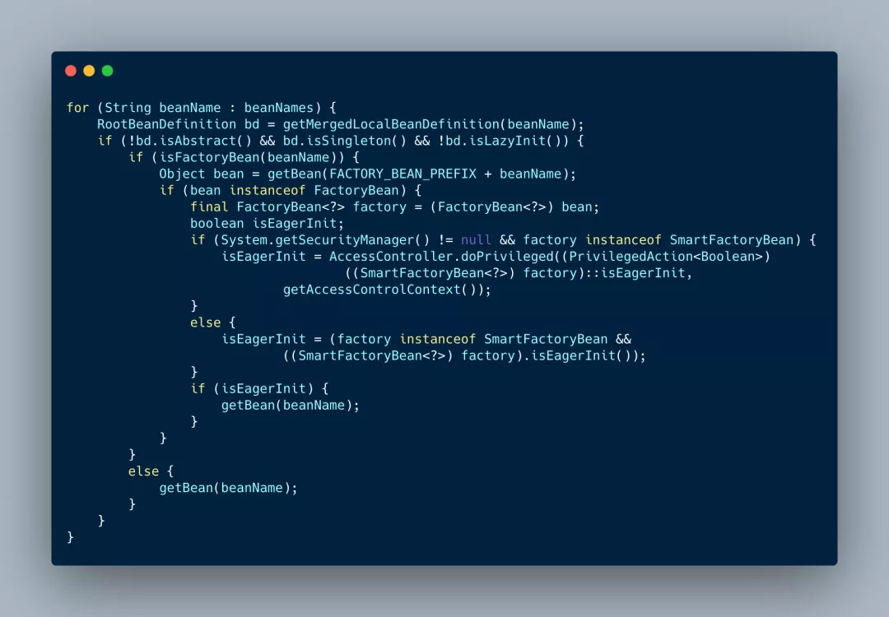

# BeanFactory和FactoryBean的区别
## 区别

说实话，他俩除了名字比较像以外，好像没有其他共同点了。

**「BeanFactory和FactoryBean有哪些区别？」**

   1. BeanFactory是一个最基础的IOC容器，提供了依赖查找，依赖注入等基础的功能
   
   2. FactoryBean是创建Bean的一种方式，帮助实现复杂Bean的创

   

**「ApplicationContext和BeanFactory有哪些区别？」**

   1. BeanFactory是一个最基础的IOC容器，提供了依赖查找，依赖注入等基础的功能
   2. ApplicationContext继承了BeanFactory，在BeanFactory的基础上增加了企业级的功能，如AOP，资源管理（Resources）事件（Event），国际化（i18n），Environment抽象等


## 创建Bean的方式

常见的创建Bean的方式有如下四种

1. 通过构造器

2. 通过静态工厂方法

3. 通过Bean工厂方法

4. 通过FactoryBean

   ```java
   @Data
   @ToString
   public class User {
   
       private Long id;
       private String name;
   
       public static User createUser() {
           User user = new User();
           user.setId(1L);
           user.setName("li");
           return user;
       }
   }
   ```

   ```java
   public class UserFactory {
   
       public User createUser() {
       	return User.createUser();
       }
   }
   ```

   ```java
   public class UserFactoryBean implements FactoryBean {
   
       @Override
       public Object getObject() throws Exception {
           return User.createUser();
       }
   
       @Override
       public Class<?> getObjectType() {
           return User.class;
       }
   }
   ```

   ```xml
   <?xml version="1.0" encoding="UTF-8"?>
      <beans xmlns="http://www.springframework.org/schema/beans"
      xmlns:xsi="http://www.w3.org/2001/XMLSchema-instance"
      xsi:schemaLocation="http://www.springframework.org/schema/beans
      https://www.springframework.org/schema/beans/spring-beans.xsd">
   
    <!-- 构造方法实例化 Bean -->
    <bean id="user-by-constructor" class="com.javashitang.domain.User">
     <property name="id" value="1"/>
           <property name="name" value="li"/>
    </bean>
   
    <!-- 静态方法实例化 Bean -->
   <bean id="user-by-static-method" class="com.javashitang.domain.User"
   factory-method="createUser"/>
   
    <bean id="userFactory" class="com.javashitang.factory.UserFactory"/>
   
    <!-- Bean工厂方法实例化 Bean -->
    <bean id="user-by-factory" factory-bean="userFactory" factory-method="createUser"/>
   
    <!-- FactoryBean实例化 Bean -->
    <bean id="user-by-factory-bean" class="com.javashitang.factory.UserFactoryBean"/>
   </beans>
   ```

   

   ```java
   public class BeanInstantiationDemo {
   
       public static void main(String[] args) {
           BeanFactory beanFactory = new ClassPathXmlApplicationContext("classpath:/bean-instantiation-context.xml");
           User user1 = beanFactory.getBean("user-by-constructor", User.class);
           User user2 = beanFactory.getBean("user-by-static-method", User.class);
           User user3 = beanFactory.getBean("user-by-factory", User.class);
           User user4 = beanFactory.getBean("user-by-factory-bean", User.class);
       }
   }
   ```

   


## 实现原理

在分析源码之前，我们先明确2个概念

> **「factoryBean是我们配置到容器中的实现FactoryBean接口的Bean，而subBean是用FactoryBean创建出来的Bean」**

在Spring容器启动的过程中，会实例化非延迟的单例Bean，即调用如下方法 
`DefaultListableBeanFactory#preInstantiateSingletons`



调用`FactoryBean#getObject`的链路如下图


通过分析DefaultListableBeanFactory#preInstantiateSingletons方法和FactoryBean#getObject的调用链路可以分析得到

1. 单例的factoryBean对象本身会在spring容器启动时主动初始化。而subBean的初始化则是在第一次从缓存中获取factoryBean并且不为空才会触发
2. 如果factoryBean对象实现的接口是SmartFactoryBean且isEagerInit方法返回true，那么subBean对象也会在spring容器启动的时候主动初始化
3. 如果bean注册的时候，beanName对应的bean实例是一个factoryBean，那么我们通过getBean(beanName)获取到的对象将会是subBean对象；如果要获取工厂对象factoryBean，需要使用getBean("&" + beanName)
4. 单例的subBean也会缓存在spring容器中，具体的容器是FactoryBeanRegistrySupport#factoryBeanObjectCache，一个Map<beanName, subBean实例>

**「建议大家看一下DefaultListableBeanFactory#preInstantiateSingletons方法和FactoryBean#getObject方法的调用链路，就能理解上面我说的流程了，我就不贴太多源码了」**

## 应用

目前我只在Dubbbo源码中看到了FactoryBean的应用

**「服务导出：在Dubbo中，服务提供者会被包装成ServiceBean对象，当监听到ContextRefreshedEvent事件时开始服务导出」**

**「服务调用：服务调用方会被包装成ReferenceBean对象，ReferenceBean实现了FactoryBean接口和InitializingBean接口，创建subBean的逻辑在ReferenceBean#getObject方法中」**

**「Dubbo服务引入的时机有如下2种。」**

1. 饿汉式：init=true，在Bean生命周期的初始化阶段会调用InitializingBean#afterPropertiesSet方法，而这个方法会调用ReferenceBean#getObject方法，完成subBean的创建，即ReferenceBean实例化时完成服务引入
2. 懒汉式：init=false，在ReferenceBean对应的服务被注入到其他类中时，此时会调用AbstractApplicationContext#getBean，获取ReferenceBean对象，因为ReferenceBean实现了FactoryBean接口，所以会调用ReferenceBean#getObject方法，完成subBean的创建，即完成服务引入

```java
public class ReferenceBean<T> extends ReferenceConfig<T> implements FactoryBean, ApplicationContextAware, InitializingBean, DisposableBean {

    @Override
    public Object getObject() {
        return get();
    }

    @Override
    @SuppressWarnings({"unchecked"})
    public void afterPropertiesSet() throws Exception {

        // 省略部分代码
        if (shouldInit()) {
            getObject();
        }
    }

}
```

